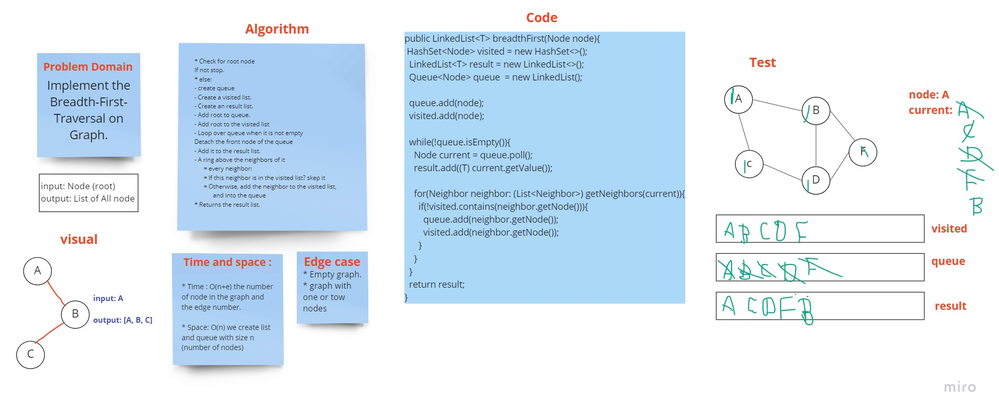

# Challenge Summary
<!-- Description of the challenge -->

Implement the Breadth-First-Traversal on Graph.
## Whiteboard Process
<!-- Embedded whiteboard image -->

## Approach & Efficiency
<!-- What approach did you take? Why? What is the Big O space/time for this approach? -->

* Time : O(n+e) the number of node in the graph and the edge number.

* Space: O(n) we create list and queue with size n (number of nodes)
## Solution
<!-- Show how to run your code, and examples of it in action -->

[code source](app\src\main\java\graph\Graph.java)
