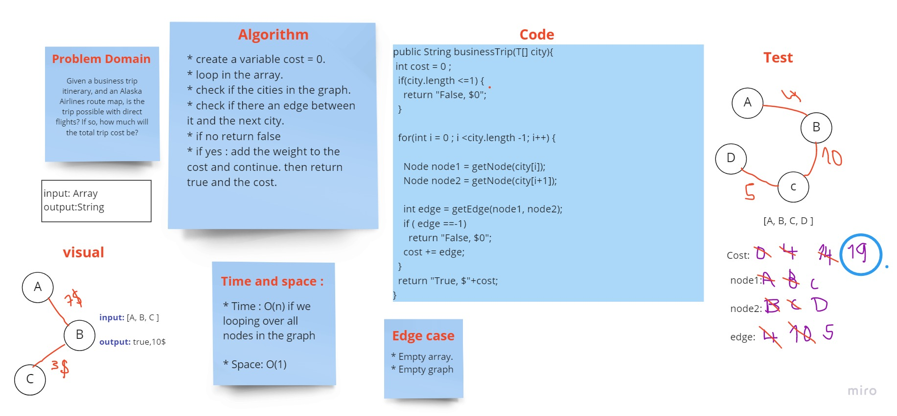

# Challenge Summary
<!-- Description of the challenge -->

Given a business trip itinerary, and an Alaska Airlines route map, is the trip possible with direct flights? If so, how much will the total trip cost be?

## Whiteboard Process
<!-- Embedded whiteboard image -->

## Approach & Efficiency
<!-- What approach did you take? Why? What is the Big O space/time for this approach? -->

Time: O(n)

Space: O(1)

## Solution
<!-- Show how to run your code, and examples of it in action -->

[ Source code ](https://github.com/Hiba-Almade/data-structures-and-algorithms/blob/main/java/graph/app/src/main/java/graph/Graph.java)
