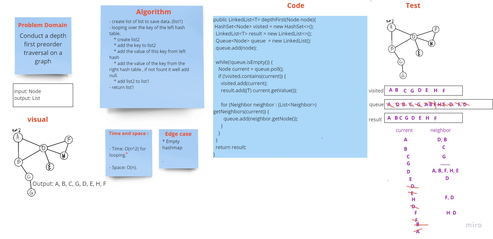

# Challenge Summary
<!-- Description of the challenge -->

Conduct a depth first preorder traversal on a graph

## Whiteboard Process
<!-- Embedded whiteboard image -->

## Approach & Efficiency
<!-- What approach did you take? Why? What is the Big O space/time for this approach? -->

- create list of list to save data. (list1)
- looping over the key of the left hash table.
  * create list2
  * add the key to list2
  * add the value of this key from left hash
  * add the value of the key from the right hash table , if not fount it well add null.
  * add list2 to list1
- return list1

- Time: O(n)

- Space: O(1)

## Solution
<!-- Show how to run your code, and examples of it in action -->

[ Source code ](https://github.com/Hiba-Almade/data-structures-and-algorithms/blob/main/java/graph/app/src/main/java/graph/Graph.java)
