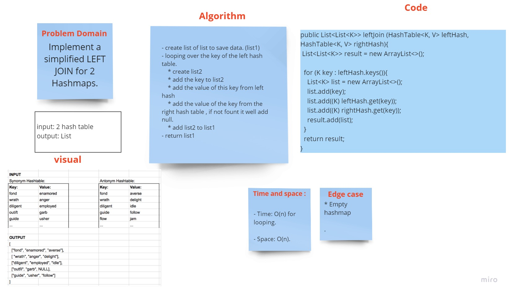

# Hashmap LEFT JOIN
<!-- Short summary or background information -->
Implement a simplified LEFT JOIN for 2 Hashmaps.

## Challenge
<!-- Description of the challenge -->

Write a function that LEFT JOINs two hashmaps into a single data structure.

`>>` LEFT JOIN means all the values in the first hashmap are returned, and if values exist in the “right” hashmap, they are appended to the result row.

If no values exist in the right hashmap, then some flavor of NULL should be appended to the result row.

## Whiteboard

## Approach & Efficiency
<!-- What approach did you take? Why? What is the Big O space/time for this approach? -->

- Time: O(n) for looping.

- Space: O(n)
## Solution
<!-- Embedded whiteboard image -->
[code source](LeftJoin.java)
