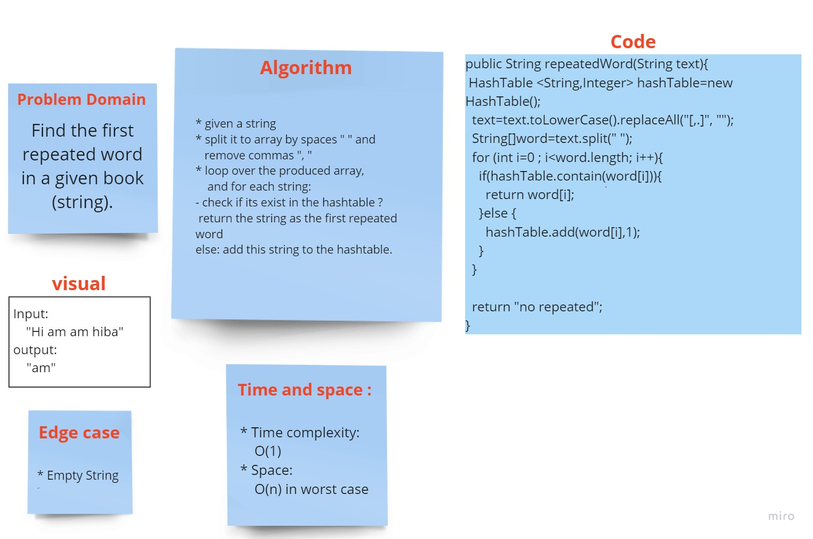

### First Repeated Word

# Challenge Summary
<!-- Description of the challenge -->
Find the first repeated word in a given book (string).
## Whiteboard Process
<!-- Embedded whiteboard image -->

## Approach & Efficiency
<!-- What approach did you take? Why? What is the Big O space/time for this approach? -->
- **space:** O(n)  in worst case.. the string will be consists of letters in this case to split this string we need an array almost of size n.

- **time:** The average case: O(n) where n is the size of the split array, although the operations of contains(key) and add the key to the hashtable, cost O(1).
## Solution
<!-- Show how to run your code, and examples of it in action -->

repeatedWord(text); text must be a string value, will return a string which is the first repeated word in the entered string, if there is no repeated words, will return "no repeated".
[Source code](Repeated.java)
