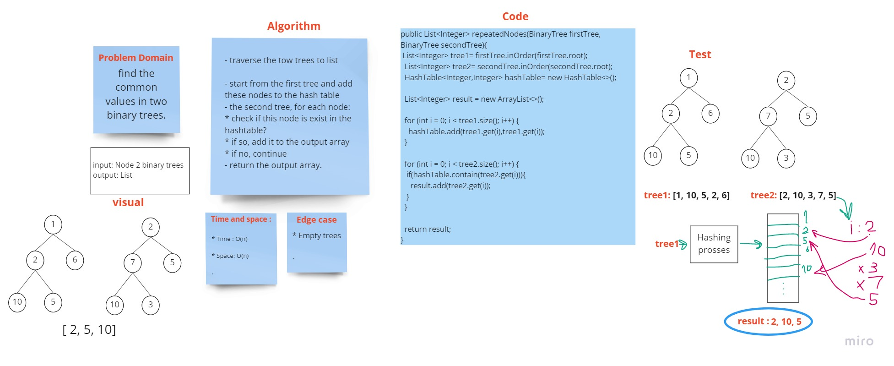

# Challenge Summary
<!-- Description of the challenge -->

find the common values in two binary trees.

- Arguments: two binary trees
- Return: return a set of values found in both trees.
## Whiteboard Process
<!-- Embedded whiteboard image -->

## Approach & Efficiency
<!-- What approach did you take? Why? What is the Big O space/time for this approach? -->

- traverse the tow trees to list

- start from the first tree and add these nodes to the hash table
- the second tree, for each node:
  * check if this node is exist in the hashtable?
  * if so, add it to the output array
  * if no, continue
- return the output array.

* Time : O(n)

* Space: O(n)

## Solution
<!-- Show how to run your code, and examples of it in action -->
[Source code](TreeIntersection.java)
