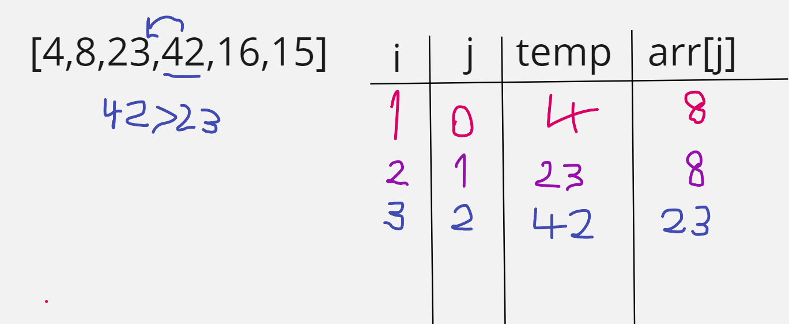

####Insertion sort:
Is a simple sorting algorithm that works similar to the way you sort playing cards in your hands. The array is virtually split into a sorted and an unsorted part. Values from the unsorted part are picked and placed at the correct position in the sorted part.

### Trace:

Sample Array: [8,4,23,42,16,15]

#### step 1:

* Starting from the second element with the value 4
* Compare it to all previous items.
* 8 > 4 .. shift the number to the right
* There are no more items to compare..

#### step 2:

* Go to index 2 as value = 23
* Compare with all previous items (8, 4)
* 23 > 8.. no need to shift

#### step 3:

* Go to index 3 as value = 42
* Compare with all previous items (23, 8, 4)
* 42 >23.. no need to shift

#### step 4:

* go the index 4 as value = 16
* compare with all previous elements (42, 23, 8, 4)
* 42 >16.. shift 42 to the right.
* 23 >16.. shift 23 to the right.
* 16 > 8..no need to shift

#### step 5:

* go the index 5 as value = 15
* compare with all previous elements (42, 23, 16, 8, 4)
* 42 >15.. shift 42 to the right.
* 23 >15.. shift 23 to the right.
* 16 >15..  shift 16 to the right.
* 15 > 8..no need to shift
---

#### output:

Sorted array : **[4, 8, 15, 16, 23, 42]**

