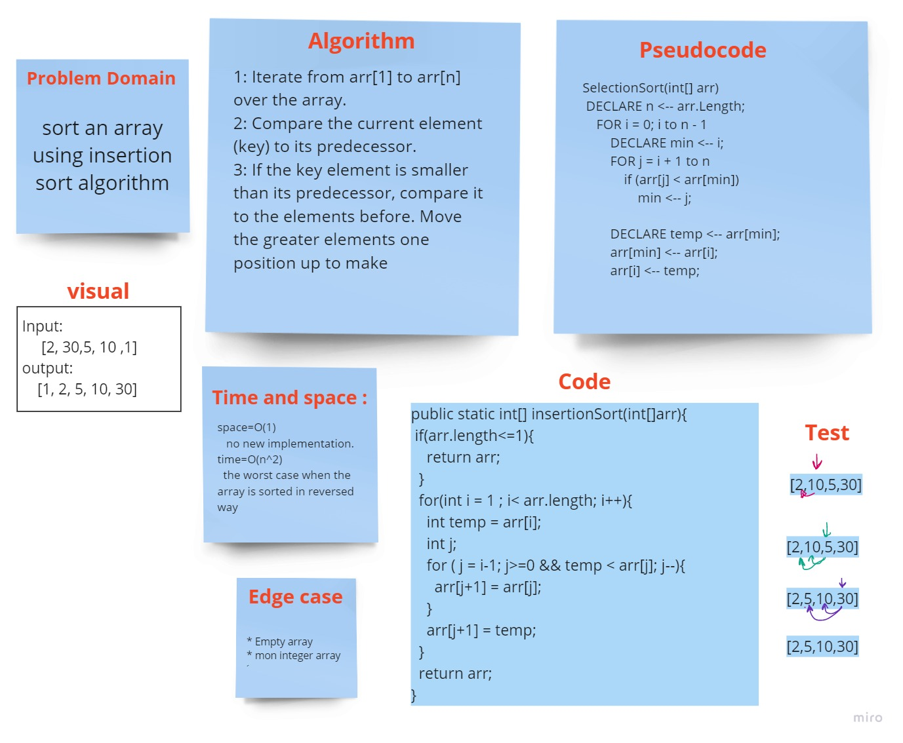

## insertion sort:

# Challenge Summary
sort an array using insertion method
## Whiteboard Process

## Approach & Efficiency
<!-- What approach did you take? Why? What is the Big O space/time for this approach? -->
`insertionSort(array)`:  method will take an array as an argument then return the sorted array.
## Solution
<!-- Show how to run your code, and examples of it in action -->
1. Iterate from arr[1] to arr[n] over the array.
2. Compare the current element (key) to its predecessor.
3. If the key element is smaller than its predecessor, compare it to the elements before. Move the greater elements one position up to make

[Blog =>](BLOG.md)
