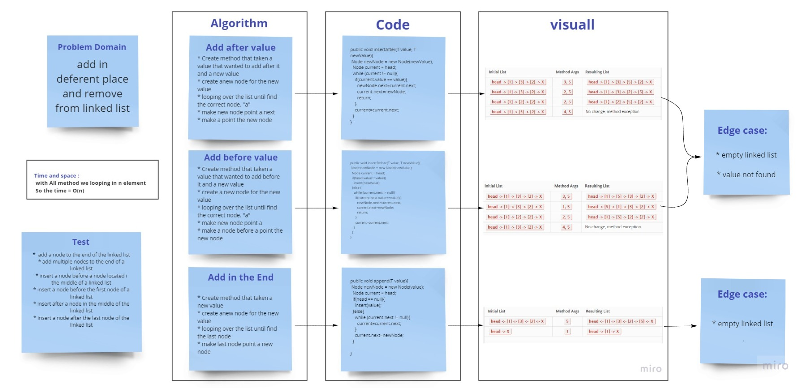

# Challenge Summary
<!-- Description of the challenge -->
Method that add new node int the end of linked list ,after node , or before node
## Whiteboard Process
<!-- Embedded whiteboard image -->

## Approach & Efficiency
<!-- What approach did you take? Why? What is the Big O space/time for this approach? -->

looping over the linked list to find the correct place to add a new node.
## Solution
