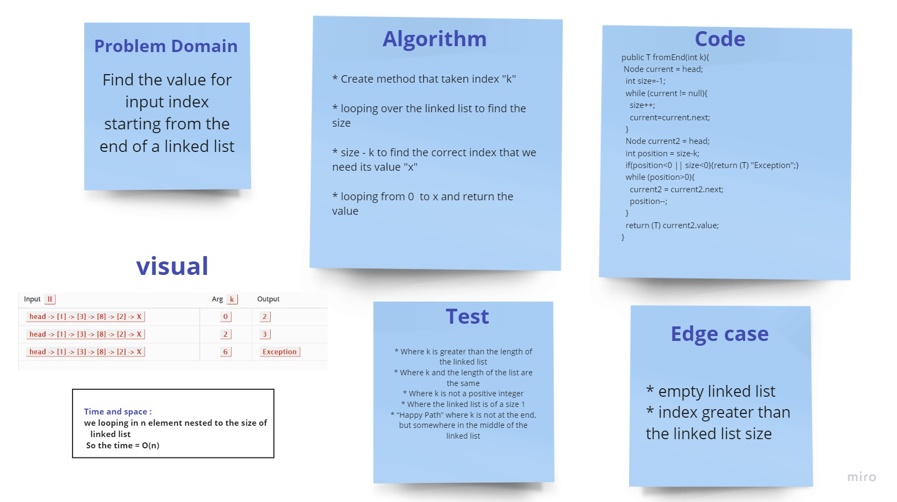

# Challenge Summary
<!-- Description of the challenge -->

* kth from end
  * argument: a number, k, as a parameter.
  * Return the node’s value that is k places from the tail of the linked list.
  
[source code](https://github.com/Hiba-Almade/data-structures-and-algorithms/tree/main/java/linkedList/app/src/main/LinkedList.java)
## Whiteboard Process
<!-- Embedded whiteboard image -->

## Approach & Efficiency
<!-- What approach did you take? Why? What is the Big O space/time for this approach? -->
looping over the linked list to find the size , then anther loop to the correct index

the time = O(n)
