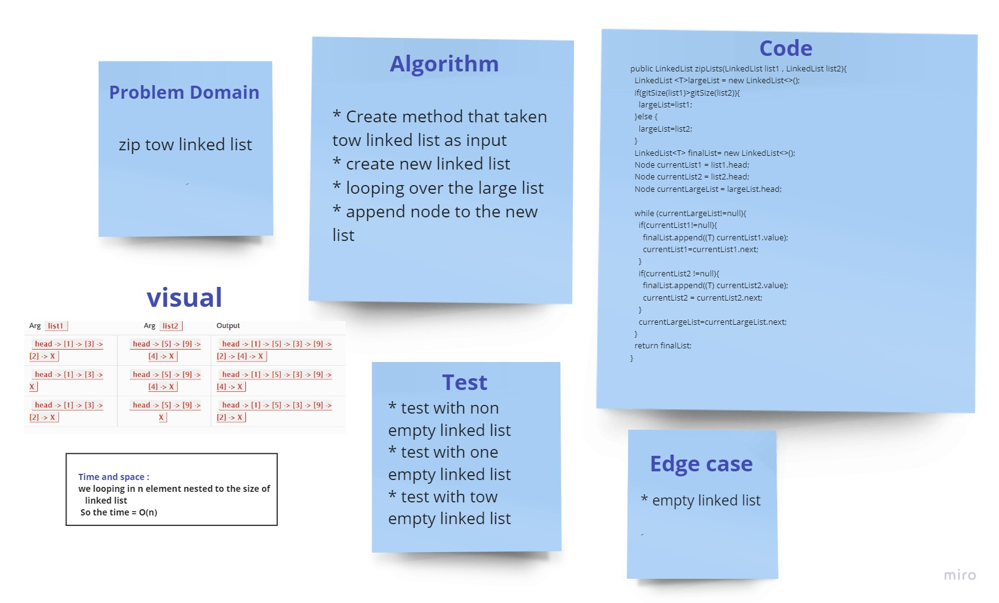

# Challenge Summary
<!-- Description of the challenge -->

* zipLists:
  * Arguments: 2 linked lists
  * Return: Linked List, zipped as noted below
  * Zip the two linked lists together into one so that the nodes alternate between the two lists and return a reference to the head of the zipped list.
## Whiteboard Process
<!-- Embedded whiteboard image -->

## Approach & Efficiency
<!-- What approach did you take? Why? What is the Big O space/time for this approach? -->
looping over the large linked list , append all node to new linked list

the time = O(n)
