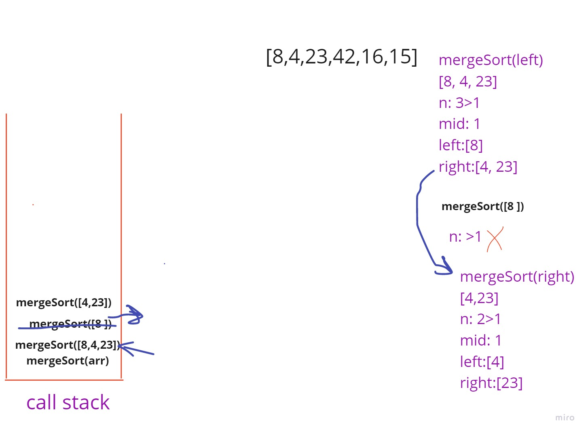
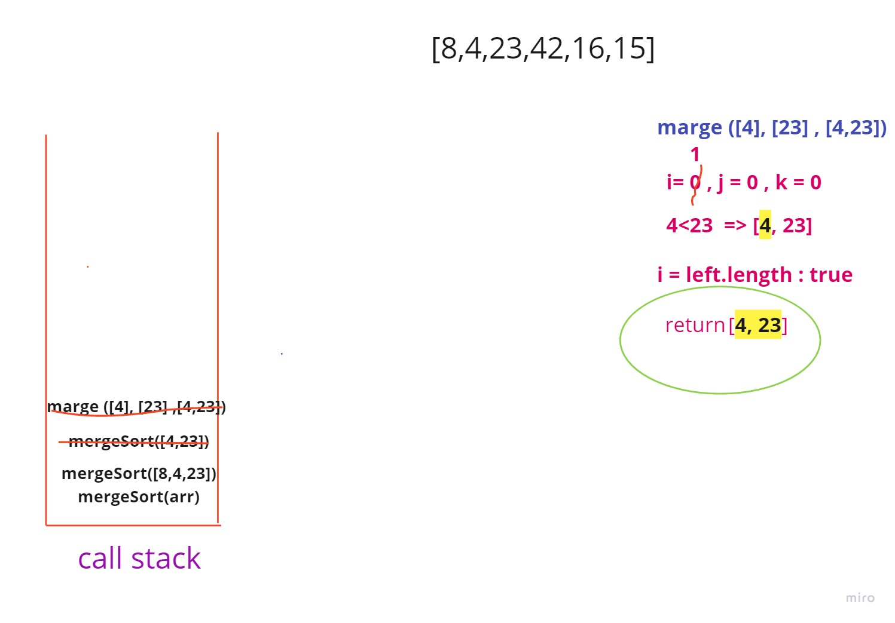

### Merge Sort:

Merge Sort is a Divide and Conquer algorithm. It divides the input array into two halves, calls itself for the two halves, and then merges the two sorted halves. The merge() function is used for merging two halves. The merge(arr, l, m, r) is a key process that assumes that arr[l..m] and arr[m+1..r] are sorted and merges the two sorted sub-arrays into one.

#### Pseudocode:

ALGORITHM Mergesort(arr)
DECLARE n <-- arr.length

    if n > 1
      DECLARE mid <-- n/2
      DECLARE left <-- arr[0...mid]
      DECLARE right <-- arr[mid...n]
      // sort the left side
      Mergesort(left)
      // sort the right side
      Mergesort(right)
      // merge the sorted left and right sides together
      Merge(left, right, arr)

    ALGORITHM Merge(left, right, arr)
    DECLARE i <-- 0
    DECLARE j <-- 0
    DECLARE k <-- 0

    while i < left.length && j < right.length
        if left[i] <= right[j]
            arr[k] <-- left[i]
            i <-- i + 1
        else
            arr[k] <-- right[j]
            j <-- j + 1

        k <-- k + 1

    if i = left.length
       set remaining entries in arr to remaining values in right
    else
       set remaining entries in arr to remaining values in left

#### Trace:

Sample Array: **`[8,4,23,42,16,15]`**

##### Step 1:

- in this step the array size (6) > 1, so will divide this array into two halves
- after dividing the array will recall the function and pass the left part of the array as an argument
- the callback stack will have the original part of it

##### Step 2:

- after dividing the array will recall the function and pass the left part of the array as an argument.
- in this step the array size is grater than 1 which is 3 so will divide this array into two halves (left and right)
- after dividing the array will recall the function and pass the left part of the array as an argument

##### Step 3:

- the array size is one. so will retrieve it as it is and pop this call function from the callback stack.

- now the left part of the step 2 array. will be done
- call the function again with passing the right part this time as an argument [4,23]

##### Step 4:

- the input array now is [4,23] divide it into two halves [4] , [23]
- pass the left part [4] to the mergeSort function will return itself [4] because its size is one..
- call the function again with the right part ,  will return [23]

##### Step 5:

we still inside the function with the array of [4,23]

`>` after the calls for the left and the right parts:

- call the merge function which take the left and right and the original array as arguments.
- the merge function will create three variables i, j, k

- i  will iterate on the left part of the array.

- j will iterate on the right part of the array.

- k will iterate on the original array.

In this step the left and right sizes are one.

- merge function will loop over the left and right arrays and compare the corresponding element of each of them with together while the both arrays is not reach to the end of themself.

- each time will compare it and take the smallest element and add it to the original array. then update the k and the index of which part pick the element by increasing them by one.

- 4 < 23 => add 4 to the original array in index k=0. then update k = 1 , i = 1.

- now will notice that the left part reach to the end, so will put all the rest element in the another part in the original array. in this case we only have 23 in the right part.. so add it to the original array in the index 1 now i will be equal 1, j = 1, k = 2

- the two parts is merged. then finally return the array which is [4, 23]

- back again to the function of the array [ 4,23] the left and right part is done. the merge operation is also done and now the original array is updated to the [4, 23] ( in this case no changes on it) now will return the array. and pop the function from the stack.

##### Step 6:

we're done with the right part and will continue the progress.

- we have in the function of the array [8,4,23]

- the left part is done [8] the right part is done [4,23]

`>` now will merge them together

- 4< 8, so add 4 as the first element of the original array
- update the indices (j=1, k=1)
- 8<23 so add 8 as the second element of the original array
- update the indices (i=1, k=2)
- the left part is reach to the end. so will add the rest elements of the right part to the original array.. [4,8,23]
- the merge process is done. return the array back.

##### Step 7:

back to the step 1. we have now done with the left part.

- recall the function mergeSort with the right part which is (42,16,15)

- divide this new array into two halves again. [42], [16,15]

- the left part will retrieve itself

- pass the right part to the mergeSort function.
  - call the function with the left part. will return itself [16]
  - the same for right part. will return [15]

##### Step 8:

merge them together:

- 16<42 so add 16 as the first element of the original array.
- update: (i=0, j=1, k=1)
- right part is finish, so add the left part to the original array.
- done with merging and return [15,16]
- pop it from the stack

##### Step 9:

- call the merge function ( [42],[15,16], [42,16,15])

- 15<42 , so add 15as the first element of the original array

- update: (j=1, k=1)

- 42>16 so add 16 as the second element of the original array

- update: (j=2, k=2)

- the right part is finish. so will add the rest elements of the left part[42] to the original array. [15,16,42]

- return the array after updated. and pop the call for this function from the stack.

##### Step 10:

`>` we have now done with the left and right parts and will continue the progress by merging them.

- call the merge function ( [4,8,23],[15,16,42], [8,4,23,42,16,15])

- 4<15 , so 4 as the first element of the original array

- update:(i=1, k=1)

- 8<15, so add 8 as the second element of the original array

- update: (i=2, k=2)

- 23<15, so add 15 as the third element of the original array

- update:(j=1, k=3)

- 23>16, so add 16 as the forth element of the original array

- update: (j=2, k=4)

-23<42, so add 23 as the fifth element of the original array

- update: (i=3, k=5)

- the left part is reach to the end. so will add the rest elements of the right part[42] to the original array.. [4,8,15,16,23,42]

- the merge process is done.
- return the array after updated. and pop the call for this function from the stack.

##### Finish:
The callBack stack now is empty. and The output is: **[4,8,15,16,23,42]**

