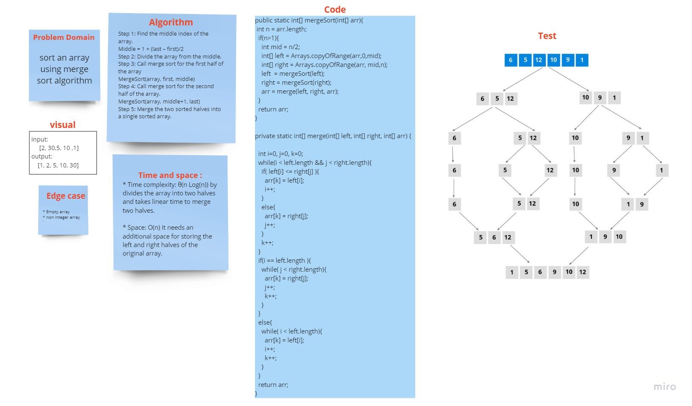

### Marge Sort:

# Challenge Summary

write an algorithm to sort an array using the marge method

## Whiteboard Process
<!-- Embedded whiteboard image -->

## Approach & Efficiency
<!-- What approach did you take? Why? What is the Big O space/time for this approach? -->
* Time complexity: θ(n Log(n)) by divides the array into two halves and takes linear time to merge two halves.

* Space: O(n) It needs an additional space for storing the left and right halves of the original array.

## Solution
<!-- Show how to run your code, and examples of it in action -->

[Blog => ](BLOG.md)

[Source Code =>](app/src/main/java/mergeSort/App.java)

