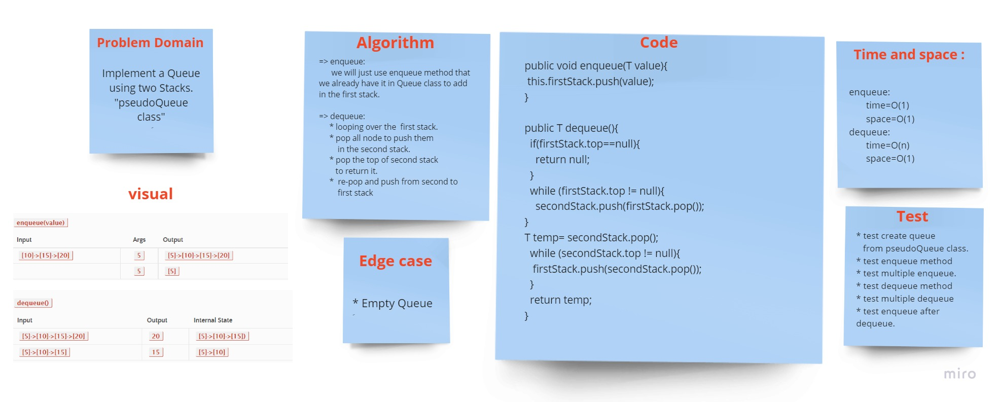

# Challenge Summary
<!-- Description of the challenge -->
Implement a Queue using two Stacks.

## Whiteboard Process
<!-- Embedded whiteboard image -->

## Approach & Efficiency
<!-- What approach did you take? Why? What is the Big O space/time for this approach? -->

We're creating a `pseudoQueue` class, that contain:

* tow Stack which we need it to implement the Queue

* `enqueue(value)`:  method to add the value to the end of the queue.

* `dequeue()`: method should return and remove the first element of the queue.

## Solution
<!-- Show how to run your code, and examples of it in action -->

