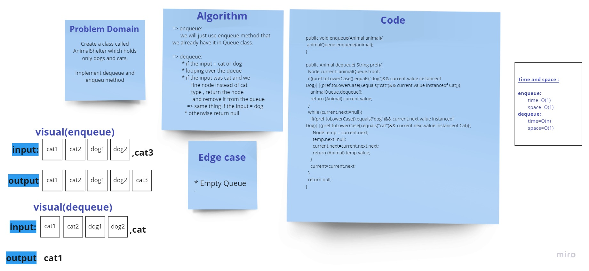

# Challenge Summary
we have an AnimalShelter class which holds only dogs and cats using a first-in, first-out approach.

## Whiteboard Process
<!-- Embedded whiteboard image -->

## Approach & Efficiency
<!-- What approach did you take? Why? What is the Big O space/time for this approach? -->
we create new method:
* **enqueue(Animal)** to add an Animal (Dog or Cat) into the queue of animals
* **dequeue(pref)** to Return: either a dog or a cat, based on preference. pref is not "dog" or "cat" then return null.
## Solution
<!-- Show how to run your code, and examples of it in action -->

`=>` enqueue:

we will just use enqueue method that we already have it in Queue class.

`=>` dequeue:

* if the input = cat or dog
* looping over the queue
* if the input was cat, and we find node instead of cat type , return the node and remove it from the queue

  => same thing if the input = dog
* otherwise return null
