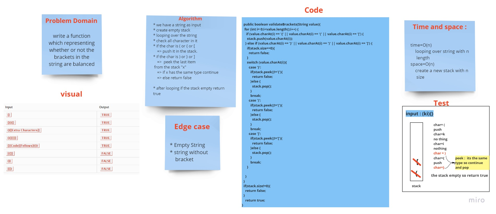

# Challenge Summary
<!-- Description of the challenge -->
representing whether the brackets in the string are balanced.
## Whiteboard Process
<!-- Embedded whiteboard image -->

## Approach & Efficiency
<!-- What approach did you take? Why? What is the Big O space/time for this approach? -->
create a method `validateBrackets` that take a string as input and check if all the bracket closed correctly.
## Solution
<!-- Show how to run your code, and examples of it in action -->
looping over the string every close bracket should be after the open bracket with the same type and order.

`ex:`

"( )" ==> true

"( }" ==> false
"(hello){}" ==> tree

"[ ( ] )" ==> false
