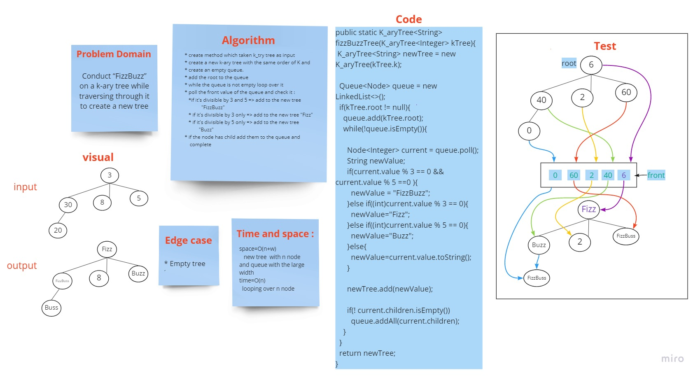

# Challenge Summary
<!-- Description of the challenge -->
FizzBussTree method

## Whiteboard Process
<!-- Embedded whiteboard image -->

## Approach & Efficiency

* If the value is divisible by 3, replace the value with “Fizz”
* If the value is divisible by 5, replace the value with “Buzz”
* If the value is divisible by 3 and 5, replace the value with “FizzBuzz”
* If the value is not divisible by 3 or 5, simply turn the number into a String.

## Solution
<!-- Show how to run your code, and examples of it in action -->

* create method which taken k_try tree as input
* create a new k-ary tree with the same order of K and * create an empty queue.
* add the root to the queue
* while the queue is not empty loop over it
* poll the front value of the queue and check it :
  *if it's divisible by 3 and 5 => add to the new tree
  "FizzBuzz"
  * if it's divisible by 3 only => add to the new tree "Fizz"
  * if it's divisible by 5 only => add to the new tree
  "Buzz"
* if the node has child add them to the queue and
  complete
