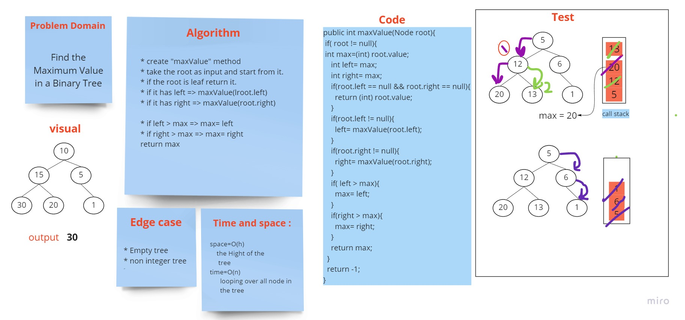

# Challenge Summary
<!-- Description of the challenge -->
Find the Maximum Value in a Binary Tree

[code source](https://github.com/Hiba-Almade/data-structures-and-algorithms/blob/main/java/trees/app/src/main/java/trees/BinaryTree.java)
## Whiteboard Process
<!-- Embedded whiteboard image -->

## Approach & Efficiency
<!-- What approach did you take? Why? What is the Big O space/time for this approach? -->
maxValue: return the max number after looping over all node in the tree
## Solution
<!-- Show how to run your code, and examples of it in action -->

* create "maxValue" method
* take the root as input and start from it.
* if the root is leaf return it.
* if it has left => maxValue(lroot.left)
* if it has right => maxValue(root.right)

* if left > max => max= left
* if right > max => max= right
  return max
