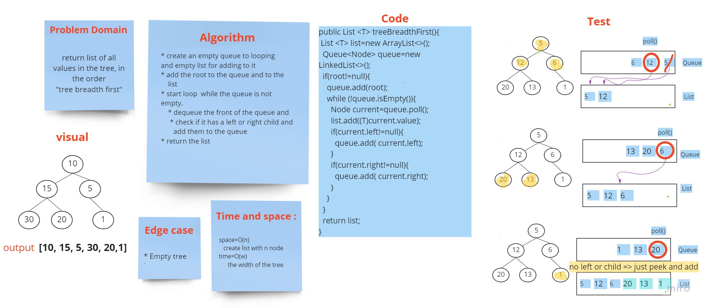

# Challenge Summary
<!-- Description of the challenge -->
Breadth-first Traversal.

[code source](https://github.com/Hiba-Almade/data-structures-and-algorithms/blob/main/java/trees/app/src/main/java/trees/BinaryTree.java)
## Whiteboard Process
<!-- Embedded whiteboard image -->

## Approach & Efficiency

treeBreadthFirst: return the list of value in breadth order
## Solution
<!-- Show how to run your code, and examples of it in action -->
* create an empty queue to looping
  and empty list for adding to it
* add the root to the queue and to the
  list
* start loop  while the queue is not empty.
  * dequeue the front of the queue and check if it has a left or right child and
  add them to the queue
* return the list
